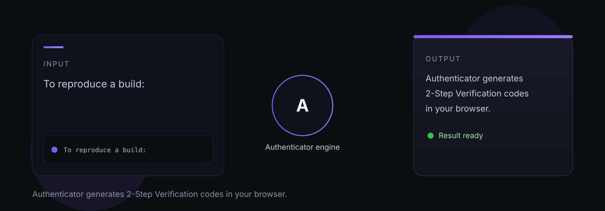

# Authenticator

Authenticator — Authenticator generates 2-Step Verification codes in your browser.

> One clear job, done well.

## Dependencies

npm install

---

*Authenticator is part of the [OCAS Agent Suite](https://github.com/indigokarasu).*